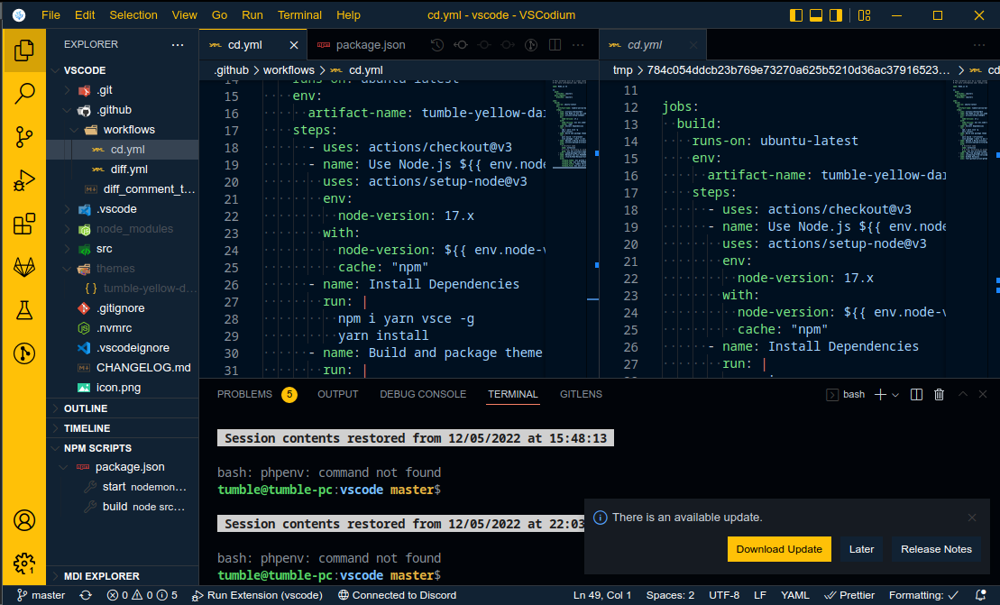

> Meved to https://git.disroot.org/tumble/tumble-yellow-dark-vscode

# Tumble Yellow Dark Theme

VSCode Theme based on the color scheme of my portfolio



# Install

Install [VSCode](https://code.visualstudio.com/)/[VSCodium](https://vscodium.com/#install), NodeJS, [Yarn](https://yarnpkg.com/getting-started/install), and [VSCE](https://code.visualstudio.com/api/working-with-extensions/publishing-extension).

```bash
# First install the npm packages with yarn
yarn
# Build the theme
yarn run build
# Build the extension
vsce package
```

# GitHub's VS Code themes
This project is a fork of the GitHub VS Theme by [Primer](https://github.com/primer)

